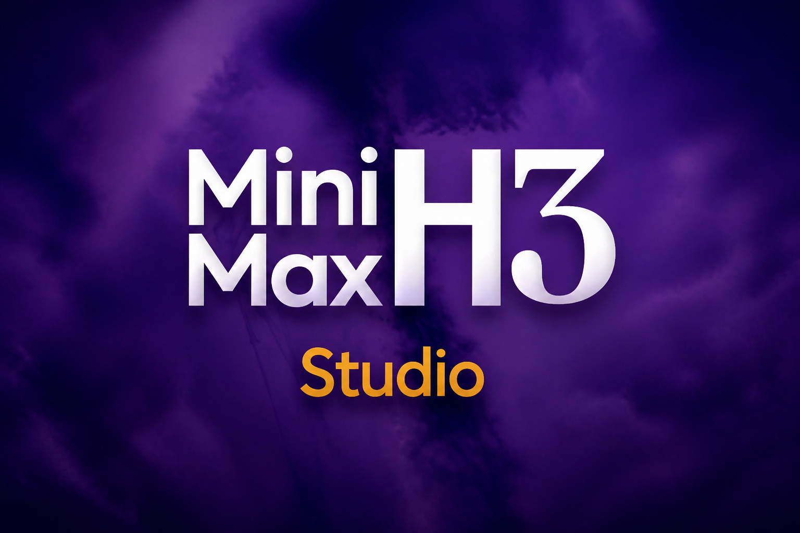

# MiniMax H3 Studio

<p align="center">
  
</p>

Pinokio 1-click launcher: [MiniMax H3](https://huggingface.co/MiniMaxAI/MiniMax-H3) in ComfyUI, plus **H3 Studio** (Director, Plan, cinema studio, TR/EN). NVIDIA GPU.

H3 is an omni-modal generative system: it takes text, images, video and audio as context and generates **video with native stereo audio** — 4–15 seconds, 24 FPS, 32 kHz stereo, in a wide range of aspect ratios (21:9 through 9:16). It handles 11 languages of spoken dialogue.

Default output is a 768-pixel short edge, but that is a default, not a limit — see [Resolution](#resolution--you-are-not-capped-at-768p) below for running at 1080p and up.

---

## What this launcher installs

| Component | File | Size |
|---|---|---|
| H3-Encoder (Qwen3-VL-32B) | `qwen3vl_32b_minimax_h3_nvfp4_awq.safetensors` | 15.7 GB |
| H3-VisualVAE | `minimax_h3_video_vae_fp16.safetensors` | 5.2 GB |
| H3-AudioVAE | `minimax_h3_audio_vae_fp32.safetensors` | 0.6 GB |
| H3-Base-FL2VA | `minimax_h3_fl2va_pruned_int8_convrot.safetensors` | 21.0 GB |
| H3-Base-Ref2VA | `minimax_h3_ref2va_pruned_int8_convrot.safetensors` | 21.0 GB |
| **Total weights** | | **~63 GB** |

Plus ComfyUI and its virtualenv (~10 GB).

### Why these files and not the official ones

The official release is BF16: a single variant is ~144 GB (66 GB transformer + 67 GB text encoder + 10 GB VAE), and both variants plus the diffusers copy total ~290 GB. That does not fit on a normal SSD, and the BF16 transformer alone does not fit in 32 GB of VRAM.

Two reductions are applied, both chosen deliberately:

- **`pruned`** — drops the ~13 B AdaLN-branch parameters. The MiniMax model card states AdaLN modulation outputs "can be precomputed and cached, [so] these parameters do not need to be loaded for inference-only deployment." This is a strict win for inference, not a quality tradeoff. 33 B → ~20 B.
- **`int8_convrot` / `nvfp4_awq`** — rotation-based quantization with ComfyUI's `TensorCoreConvRotW4A4Layout` and `TensorCoreNVFP4Layout`. On Blackwell (RTX 50-series) these map onto native tensor-core instructions.

Net effect: 290 GB → 63 GB, and each model fits in 32 GB of VRAM.

### The cu130 requirement

ComfyUI's `comfy/quant_ops.py` disables the accelerated `comfy-kitchen` CUDA backend when `torch.version.cuda < 13`:

> `WARNING: You need pytorch with cu130 or higher to use optimized CUDA operations.`

Because every weight here is quantized, a cu12x torch build would still *run*, but on a dramatically slower path.

In practice ComfyUI's current `requirements.txt` **already** resolves to a CUDA 13 stack from PyPI — torch 2.13.0 (which depends on `nvidia-cudnn-cu13` / `nvidia-nccl-cu13`), torchvision 0.28.0, torchaudio 2.11.0 — so nothing needs fixing today. This launcher still ships its own `torch.js` pinning those exact versions to the cu130 index (`torch==2.13.0+cu130` etc.) as a **guarantee**: if PyPI's default torch ever reverts to a cu12x build, the launcher keeps working. The pins are equal to what ComfyUI resolves, so the step is a no-op on an up-to-date install rather than a downgrade.

The local `torch.js` also exists because the **stock** `system/examples/torch.js` pins `torch 2.7.0+cu128`, which *would* silently break the quantized path.

### Requirements

- **NVIDIA GPU.** The quantized weights and the cu130 kernels are CUDA-specific. 32 GB VRAM comfortably runs one model at a time; less will work via ComfyUI's automatic offloading, but slower.
- ~75 GB free disk.
- Linux or Windows.

---

## H3 Studio (custom UI)

Start opens **ComfyUI** (backend) and **H3 Studio** (simple front end). Top bar **TR | EN** switches the Studio UI and Director chat language (`h3Prompt` / SCENE stays English). Pinokio menu:

| Menu | Opens |
|---|---|
| **Open H3 Studio** (default) | Custom UI — prompt, 5/10/15s, continue, batch queue, Director, system bar |
| **Open ComfyUI** | Unmodified Comfy node graph (always available) |

Studio never replaces Comfy. If Studio fails, use **Open ComfyUI** as before.

### Support

Bugs and ideas: Studio top bar **Destek / Support**, or [GitHub Issues](https://github.com/erdinoral/minimax-h3-studio/issues). Use **Bug** for breakage and **Idea** for improvements.

### H3 Yönetmen (Director persona)

Bottom chat uses the local **H3 Yönetmen** persona (`studio/prompts/director_system.md`) over **Ollama** (`http://127.0.0.1:11434`). It interviews for purpose / style / 5·10·15s clips, then returns a FilmBrief + shot list with H3-ready prompts. Every chat turn injects the current shot board (and Direktör studio cards) so the model can see shot text. **Plan** mode is for reading/editing those SCENE prompts without queuing; say “shot 3’ü değiştir” and save, then **Üretime al**. Production still runs on Comfy; on generate the LLM is unloaded to free VRAM. When the last clip in the queue finishes (or you reset production), Studio asks ComfyUI to unload H3 models (`POST /free`) so VRAM is released. Continue / cinema shots in the same batch keep the models loaded between clips.

1. Start Ollama (`ollama serve`) with a chat model (e.g. `qwen3:8b` or smaller during production days).
2. Pick the model under **Ayarlar → Yönetmen modeli**.
3. Chat or tap chips → when brief is ready: **Sahneye aktar** or **Aktar + kuyruğa al**.

**Music video from a song:** expand the Director dock → **Şarkı seç** → optional concept/lyrics → **Şarkıdan brief**. Studio measures loudness per clip window (not beat-sync) and the Director writes a silent continue chain (same face/wardrobe). Queue with **Üretime al**, keep **Devam zincirine ekle** on, then **Şarkılı final** to mux your track. Face/reference stills in Reference mode help identity further. H3 will not lipsync to the file.

One-time after update (if Studio deps missing):

```text
Pinokio → Install   (or: uv pip install -r studio/requirements.txt inside app/env)
```

Studio talks to Comfy at the URL captured on start (`COMFY_URL`). Bottom bar shows CPU / RAM / GPU / VRAM / disk (ACE-Step–style, horizontal).

## Usage

1. **Install** — clones ComfyUI, installs deps + cu130 torch, downloads all weights, installs workflows, and Studio Python deps.
2. **Start** — launches ComfyUI + H3 Studio; menu switches to **Open H3 Studio** (and **Open ComfyUI**).
3. In Comfy: open the **Workflows** tab and pick one — models are already selected, nothing to wire up:

| Workflow | Mode | Transformer |
|---|---|---|
| **MiniMax H3 - Text to Video (sage3)** | text → video+audio | FL2VA |
| **MiniMax H3 - Image to Video (stock)** | first/last frame → video+audio | FL2VA |
| **MiniMax H3 - Reference to Video (sage3)** | omni-reference → video+audio | Ref2VA |

Ref2VA accepts up to 9 images, 3 video clips and 3 audio clips (12 files max, ≤15 s combined; audio can never be the only input).

These are the official Comfy-Org templates, unmodified except that the two `(sage3)` graphs have a **Patch Sage Attention KJ** node spliced between the `UNETLoader` and the model consumers, set to `sageattn3`. Set that node to **`disabled`** to A/B against stock attention.

> **Auto-open:** which workflow ComfyUI opens on launch is browser localStorage, not a file on disk, so it cannot be preset. ComfyUI's `Comfy.Workflow.Persist` setting (enabled here) reopens the last-used workflow — so open one of these once and it comes back automatically from then on.

**Reinstall Workflows** in the menu restores the three bundled graphs; it overwrites only those files and leaves your own saved workflows alone.

### Prompting

H3's quality depends heavily on prompt structure — the hosted pipeline runs a preprocessing model (H3-Context-IR) that expands your prompt into a long structured description with `integrated_multimodal_description`, `overall_soundscape` and `non_diegetic_music` sections. That module is **not open source**. To get comparable results locally, write prompts in that same structured style; see the prompting guides linked in the sidebar.

Spoken dialogue uses `<d>` tags, e.g. `<d>[English] Follow the wind, live free.</d>`

### LoRA (H3 Studio)

Production **Ayarlar**: named list — **click a LoRA to download it**, then **Uygula**. That attaches the file (and strength). **Steps stay whatever you typed** in the Steps box — a turbo LoRA can run at 4 or 10 (or any count). Sampler is also yours. The list still shows a recommended step count in the hint.

| LoRA | Size | What it does |
|---|---|---|
| **Yok** | — | Default 20 step · `res_multistep` |
| **LightX2V Turbo** | ~1.8 GB | FL2VA 4-step distill · `er_sde` · strength 0.75. New video / first-last only — skipped on Ref / V2V / face. |
| **ErosMax Turbo** | ~1.8 GB | FL2VA 4-step · same skip on Ref / face. |
| **H3 Turbo 6-step EMA** | ~0.8 GB | FL2VA 6-step · same skip on Ref / face. |
| **H3 Turbo v4 EMA** | ~0.7 GB | FL2VA turbo (`step600` is training, not 4 inference steps) — set steps yourself. |
| **H3 Realism People** | ~125 MB | T2V / I2V / Ref · keeps your step/sampler. |
| **PinkFluffyBunny** | ~2.3 GB | Character LoRA · works on new video and Ref/face. |

Missing files download into `app/models/loras` from Hugging Face when you click the name (or **Uygula**). Same files are also in Pinokio **Download Models**.

Drop extra H3 `.safetensors` via **LoRA ekle**, paste a Hugging Face **resolve** URL into **URL’den al**, or copy the file into `app/models/loras` — they appear in the same list. Studio hides SDXL / Pony / Wan / Flux / ClipProj files; those are not MiniMax H3 video LoRAs. Catalog hints may mention 4-step / 6-step as a recommendation only.

Cinema studio has the **same LoRA list** next to duration/steps (film-wide). Character cards still have an optional per-character LoRA for Ref2VA identity shots. For a consistent person without a character LoRA, use **Yüz referansı** or a Direktör still (Ref2VA).

```text
GET  /api/loras
POST /api/loras/download   # { id } catalog entry with a url (downloadable: true)
POST /api/loras/upload     # multipart .safetensors
POST /api/loras/import     # { url, filename? } direct HF / .safetensors link
```

### H3 Multishot — Kesintisiz zincir (Seamless Chain)

[ComfyUI-H3-Multishot](https://github.com/jlucasmcrell/ComfyUI-H3-Multishot) (jlucasmcrell) is a **custom node pack**, not a LoRA. It welds 10–15s H3 blocks into **one take** (picture + audio, no cut at the join). Studio queues that as a single Comfy graph (`H3MultishotSampler`, CORE path — last-frame hand-off, no Motion-Context / JoyEcho).

**Install (existing Pinokio install):** menu **Download Models → H3 Multishot (Seamless Chain) nodes**, or **Update**. Then **Stop → Start** so Comfy loads the pack.

**Cinema:** **Kesintisiz zincir** (on when the pack is present). Shot texts are joined with `---` and render as one clip. Pack limit: **8 shots**. Uncheck it to use the older per-shot Continue chain (last-frame I2V, up to 80 shots).

Optional full v2 extras (LLM writer, `context_pin`, accelerators) stay out of Studio; CORE is enough for cinema.

### Direktör · Sinema stüdyosu

**Sahne → Direktör** opens a two-column cinema studio for long-form films.

- **Sol sütun (üst/alt):** **Karakter ekle+** opens a card (name, description, reference still; optional character LoRA). **Mekan ekle+** is the same for locations (region name, description, still).
- **Film setup presets:** the first pill (**Ön ayar / Preset**) fills camera, color palette, lighting, era, purpose, style, and audio mode. You can still override any pill afterwards. **Auto** clears those locks.
- **Gallery delete** removes the card and the files: studio clip, last frame, Comfy `app/output/video/H3_Studio` copy, and uploaded last-frame stills.
- **Kalite:** duration, 480/720/1080, steps, film LoRA, and **Kesintisiz zincir** live in this panel and drive the queue.
- **Ses / müzik (Higgsfield film):** H3 cannot emit the *same* song on every shot — each clip invents a new score. **Diyalog + SFX** mode forbids generated BGM, locks each character’s **Ses tarifi** into every prompt, then you upload **one** film track and **Aynı müziği filme karıştır** after the queue finishes (dialogue stays; the score is mixed underneath). Do not use the music-video mux here — that *replaces* audio and kills speech.
- **Sağ sütun — shot listesi:** write a shot, then **+ Yeni video** (t2v / new chain) or **+ Continue** (last frame of the previous shot). Tags on each card can flip the mode later.
- Mention a character or location **name** in a shot — that still is attached on New Video shots (Ref2VA). Continue shots keep last-frame I2V and put identity in the prompt text.

```text
GET  /api/cinema
PUT  /api/cinema
POST /api/cinema/character
POST /api/cinema/location
POST /api/cinema/produce   # shots: [{ text, mode }], seamless: true → one Multishot take (max 8)
POST /api/cinema/mux       # concat clips, keep dialogue, mix one score
GET  /api/cinema/final/{batch_id}
POST /api/director/chat            # plan_mode: true → shot tahtasını görür, patch ile düzenler
POST /api/director/plan            # { session_id, shots, apply_cinema } Plan kaydet / stüdyoya aktar
POST /api/director/commit
```

```bash
# Curl — produce a film (dialogue+SFX, no generated BGM), then mix one score
curl -s -X POST http://127.0.0.1:8787/api/cinema/produce \
  -H "Content-Type: application/json" \
  -d '{"shots":[{"text":"Ada walks into Rooftop.","mode":"t2v"}],"audio":{"mode":"film","score_id":"MUSIC_ID"}}'

curl -s -X POST http://127.0.0.1:8787/api/cinema/mux \
  -H "Content-Type: application/json" \
  -d '{"batch_id":"BATCH","score_id":"MUSIC_ID"}'
```

```javascript
await fetch("/api/cinema/produce", {
  method: "POST",
  headers: { "Content-Type": "application/json" },
  body: JSON.stringify({
    shots: [{ text: "Ada walks into Rooftop.", mode: "t2v" }],
    audio: { mode: "film", score_id: musicId },
  }),
});
const mux = await fetch("/api/cinema/mux", {
  method: "POST",
  headers: { "Content-Type": "application/json" },
  body: JSON.stringify({ score_id: musicId }),
}).then((r) => r.json());
window.open(mux.final_url);
```

```python
import requests
base = "http://127.0.0.1:8787"
requests.post(f"{base}/api/cinema/produce", json={
    "shots": [{"text": "Ada walks into Rooftop.", "mode": "t2v"}],
    "audio": {"mode": "film", "score_id": music_id},
})
mux = requests.post(f"{base}/api/cinema/mux", json={"score_id": music_id}).json()
print(mux["final_url"])
```

### Resolution — you are not capped at 768p

The nodes take explicit `width` / `height` inputs (default **1344×768**, max `MAX_RESOLUTION` = 16384), so you can generate natively at 1920×1088 or higher. 768 is the *default* short edge and the resolution H3 was primarily trained at — not a ceiling.

The `MAX_PIXELS = 768*1344` constant in `nodes_minimax_h3.py` is easy to misread: it lives in `adapt_canvas()`, which is called in exactly one place — sizing **reference video** clips in the Ref2VA node. It never touches your output canvas.

Cost scales steeply with pixel count. Community figures on a 32 GB RTX 5090 at 1920×1088, INT8:

| Job | Time |
|---|---|
| 5 s, with sage-attention | ~8.4 min |
| 10 s, with sage-attention | ~23 min |
| 10 s, 20 steps, without | ~58 min |

So 1080p is very much usable — it just costs time, and quality is reportedly better than 768p. Practical levers (besides LoRA): **shorter clips**, **480p/720p**, **15 steps**, **silent decode** on music videos. Studio has **Taslak** (5s · 480p · 12) and **Hızlı** (5s · 720p · 15). Studio graphs do **not** patch Sage Attention.

See **SageAttention 3** below if you want those kernels in Comfy itself; H3 Studio no longer uses them.

At 1080p the working set exceeds 32 GB of VRAM, so ComfyUI offloads to system RAM. Your 93 GB is comfortable for this.

### SageAttention 3 (Blackwell FP4) — optional, menu-installable

RTX 50-series only. **Install SageAttention 3** in the menu builds the FP4 attention kernels from source. Measured on this exact stack (RTX 5090, sm_120, torch 2.13.0+cu130), sage3 vs PyTorch SDPA:

| shape (B,H,L,D) | pytorch | sage3 | speedup |
|---|---|---|---|
| (1, 24, 4096, 128) | 1.25 ms | 0.51 ms | **2.44×** |
| (1, 24, 16384, 128) | 18.54 ms | 6.03 ms | **3.07×** |
| (1, 16, 32768, 128) | 48.77 ms | 14.70 ms | **3.32×** |

The gain grows with sequence length — H3 packs video and audio into one long sequence, so higher resolution and longer clips benefit most.

**What the script does:** installs a private CUDA 13.0 toolkit into `./cuda13` (~4.9 GB), clones `thu-ml/SageAttention`, compiles `sageattn3` for `sm_120a` (CUTLASS is auto-cloned; 15–25 min), installs the wheel, adds ComfyUI-KJNodes, then runs a live kernel check before marking success.

The private toolkit is required because `torch/utils/cpp_extension.py` **raises** on a CUDA *major* mismatch, and Pinokio's bundled nvcc is 12.8 while our torch is cu130. Toolkit 13.0 matches torch's 13.0 exactly — not even a minor-version warning.

**How to actually use it.** `--use-sage-attention` will *not* select it — that flag picks SageAttention 1/2 and needs the separate `sageattention` package. ComfyUI registers this build as the `sage3` attention function, selected per-model via `transformer_options["optimized_attention_override"]`. Add KJNodes' **"Patch Sage Attention KJ"** node between your model loader and the sampler, mode **`sageattn3`**.

**Caveats, honestly:**
- Upstream validates SageAttention 3 on CogVideoX-2B, HunyuanVideo, Mochi and image models. **MiniMax H3 is not on that list**, and upstream explicitly warns it "does not guarantee lossless acceleration for all models." A/B it before trusting it on final renders.
- Against reference SDPA on random tensors it shows ~19% mean relative deviation. That is inherent to 4-bit attention and the metric is harsh on random inputs (real attention is far more peaked), but it is not free.
- ComfyUI bypasses it entirely when `dim_head >= 256 or N <= 1024` (`attention.py:643`), falling back to PyTorch attention.
- The widely-circulated WSL2 build report needs `PYTORCH_CUDA_ALLOC_CONF=backend:native` and a `libcuda.so` symlink. **Neither applies here** — verified working under ComfyUI's default `cudaMallocAsync` on native Linux. That report also predates official cu130 wheels (it built PyTorch from source) and concluded the low-level `fp4attn_cuda` / `fp4quant_cuda` kernels were unavailable; this build produces both.

### Not included

**H3-Regenerate-2K** has not been open-sourced by MiniMax. That is the *in-context regeneration* module — it feeds the 768p result plus the original context back through H3 to recover fine detail (small text, textures) that plain upscaling has to invent. Generating directly at high resolution, as above, is a different and cruder path to a big frame; it does not reproduce what Regenerate-2K does. The official 2K pipeline remains API-only.

---

## Menu

| Item | Effect |
|---|---|
| **Start** | Launch ComfyUI |
| **Download Models** | Fetch any variant not currently on disk |
| **Manage Disk Space** | Delete either transformer independently (21 GB each), re-downloadable later |
| **Update** | `git pull` ComfyUI + Manager, reinstall deps, restore cu130 torch |
| **Reset** | Delete ComfyUI and its venv. **Weights are kept** — they live on a Pinokio virtual drive, so a reset does not re-download 63 GB |

Weights are stored on a virtual drive under `PINOKIO_HOME/drive/drives/peers/`, linked into `app/models/`. Any peer ComfyUI install shares the same files rather than duplicating them.

---

## Troubleshooting

### Web UI is blank inside the Pinokio app, but works in an external browser

Not a launcher fault — Pinokio's HTTPS reverse proxy (**Caddy**) is missing. Caddy is what serves the `http://localhost:<PORT>` → `https://<PORT>.localhost` endpoints that Pinokio's *embedded* browser loads. Without it the webview has nothing to fetch, while `http://127.0.0.1:<PORT>` keeps working fine in a normal browser.

This affects **every** Pinokio app, not just this one — a quick way to confirm is to open another installed app's Web UI and see if it is blank too.

Diagnose:

```bash
grep -i caddy ~/pinokio/logs/stdout.txt | tail -3
#   caddy version undefined
#   caddy coerced null
#   caddy satisfied? false        <- proxy unavailable

curl -s -o /dev/null -w '%{http_code}\n' http://localhost:2019/config/   # Caddy admin API
pterm which caddy                                                        # should print a path
```

Fix — install Caddy where Pinokio looks for it, then **restart Pinokio** so it re-runs the dependency check and starts the proxy:

```bash
conda install -y -n base -c conda-forge caddy
```

(A distro package works too — on Arch/CachyOS `caddy` is in the repos — but the conda route matches how Pinokio manages its other bundled binaries and is what its `satisfied?` check inspects.)

Verify after restarting: `pterm which caddy` resolves, `http://localhost:2019/config/` answers, and `https://<PORT>.localhost` loads.

### Checking the app is actually up

`http://127.0.0.1:8188` returning HTTP 200 means ComfyUI is healthy regardless of what the embedded view shows. If the sidebar shows **Open Web UI**, `start.js` captured the URL correctly and the launcher is working.

## API

ComfyUI exposes an HTTP API on the same port as the web UI. The reliable way to build a request body:

1. Open an H3 template in ComfyUI and configure it.
2. Enable **Settings → Lite Graph → Enable dev mode options**.
3. **Workflow → Export (API)** to save `workflow_api.json`.

That file is the `prompt` object below. Find node IDs for the prompt text and the model loader by matching the `class_type` / `_meta.title` fields, then overwrite their `inputs` per request.

Replace `PORT` with the port shown in the Pinokio terminal.

### curl

```bash
BASE=http://127.0.0.1:PORT

# Queue a job. workflow_api.json must be wrapped as {"prompt": {...}}
PROMPT_ID=$(jq -n --slurpfile w workflow_api.json '{prompt: $w[0]}' \
  | curl -s -X POST "$BASE/prompt" -H 'Content-Type: application/json' -d @- \
  | jq -r '.prompt_id')

# Poll until the job appears in history
until curl -s "$BASE/history/$PROMPT_ID" | jq -e 'keys|length>0' >/dev/null; do sleep 5; done

# Download every output file the job produced
curl -s "$BASE/history/$PROMPT_ID" \
  | jq -r --arg id "$PROMPT_ID" '.[$id].outputs[] | (.gifs//.videos//.images//[])[]
      | "filename=\(.filename)&subfolder=\(.subfolder)&type=\(.type)"' \
  | while read -r q; do
      curl -s -o "$(echo "$q" | sed 's/.*filename=\([^&]*\).*/\1/')" "$BASE/view?$q"
    done
```

### Python

```python
import json, time, requests

BASE = "http://127.0.0.1:PORT"

with open("workflow_api.json") as f:
    prompt = json.load(f)

# Example: point the positive prompt node at new text.
# Look up the real node id in your exported workflow.
prompt["6"]["inputs"]["text"] = (
    "[Shot 1] Cinematic wide shot, slow push in. "
    "<d>[English] Follow the wind, live free.</d>"
)

prompt_id = requests.post(f"{BASE}/prompt", json={"prompt": prompt}).json()["prompt_id"]

while True:
    history = requests.get(f"{BASE}/history/{prompt_id}").json()
    if history:
        break
    time.sleep(5)

for node in history[prompt_id]["outputs"].values():
    for item in node.get("gifs", []) + node.get("videos", []) + node.get("images", []):
        data = requests.get(f"{BASE}/view", params={
            "filename":  item["filename"],
            "subfolder": item["subfolder"],
            "type":      item["type"],
        }).content
        with open(item["filename"], "wb") as f:
            f.write(data)
        print("saved", item["filename"])
```

### JavaScript

```javascript
import fs from "node:fs/promises";

const BASE = "http://127.0.0.1:PORT";

const prompt = JSON.parse(await fs.readFile("workflow_api.json", "utf8"));
prompt["6"].inputs.text = "[Shot 1] Cinematic wide shot, slow push in.";

const res = await fetch(`${BASE}/prompt`, {
  method: "POST",
  headers: { "Content-Type": "application/json" },
  body: JSON.stringify({ prompt }),
});
const { prompt_id } = await res.json();

let history;
while (true) {
  history = await (await fetch(`${BASE}/history/${prompt_id}`)).json();
  if (Object.keys(history).length) break;
  await new Promise((r) => setTimeout(r, 5000));
}

for (const node of Object.values(history[prompt_id].outputs)) {
  for (const item of [...(node.gifs ?? []), ...(node.videos ?? []), ...(node.images ?? [])]) {
    const q = new URLSearchParams({
      filename: item.filename,
      subfolder: item.subfolder,
      type: item.type,
    });
    const buf = Buffer.from(await (await fetch(`${BASE}/view?${q}`)).arrayBuffer());
    await fs.writeFile(item.filename, buf);
    console.log("saved", item.filename);
  }
}
```

### Endpoints

| Method | Path | Purpose |
|---|---|---|
| `POST` | `/prompt` | Queue `{"prompt": <workflow_api>}`; returns `prompt_id` |
| `GET` | `/history/{prompt_id}` | Job result; empty object until finished |
| `GET` | `/view?filename=&subfolder=&type=` | Fetch an output file |
| `GET` | `/queue` | Current queue state |
| `POST` | `/interrupt` | Cancel the running job |
| `WS` | `/ws?clientId=` | Live progress events |

---

## License

The model is covered by the [MiniMax H3 Community License](https://huggingface.co/MiniMaxAI/MiniMax-H3/blob/main/LICENSE). Review it before commercial use. ComfyUI is GPL-3.0.
